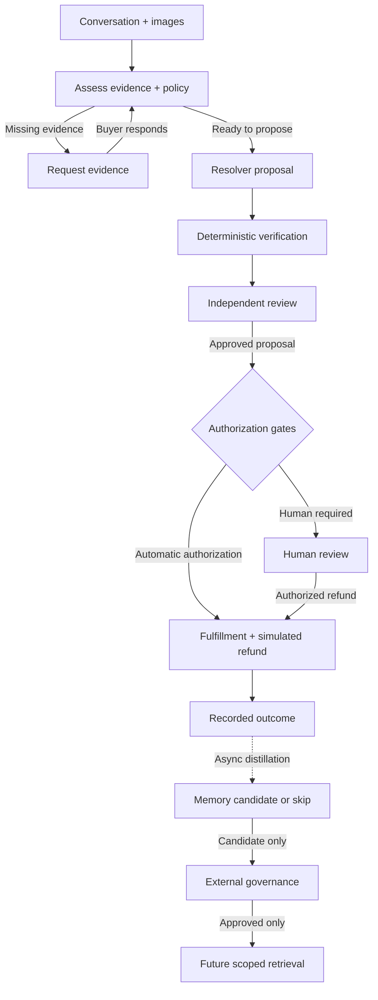

# Return Atlas — Adaptive Return Resolution Agent

[English](README.md) · [繁體中文](README.zh-TW.md)

Return Atlas helps buyers and reviewers work through e-commerce return requests, from an initial complaint to a policy-backed decision. Built by Team 27 for the Sea OpenAI Hackathon, it combines conversational AI with evidence checks, independent review, and explicit authorization before a refund can be executed.

[Watch the demo](#demo) · [Explore the architecture](https://michael3abc.github.io/2026ShopeeHackathonteam27/) · [Read the specifications](docs/spec/README.md)

## The problem: a photo is not the whole case

A buyer submits a photo of a cracked speaker. It shows damage, but does it establish that the product arrived damaged? A useful agent must identify the missing evidence, ask for it, and resume the case when it arrives—not immediately approve or reject the request.

Return Atlas treats this as a workflow rather than a single chat response. It connects the conversation and images to order facts and applicable policies, proposes a resolution, and separates that proposal from review and execution. Cases requiring additional authority go to a human; unsupported decisions do not become payment instructions.

## Demo

https://github.com/user-attachments/assets/f67e6288-6c3c-4cc5-9cf1-ed86b1656320

Watch for three transitions:

1. **Request evidence:** the agent identifies what is missing before proceeding.
2. **Resume evaluation:** additional images enter the case without starting over.
3. **Review before execution:** the interface exposes separate proposal, verification, review, and execution stages.

The recording is approximately 98 seconds, 1080p, with a Chinese interface and no audio. It shows one case, not every supported branch.

> Synthetic demo case and images; refund execution is simulated, not a real payment.

[Download MP4](https://github.com/michael3abc/2026ShopeeHackathonteam27/raw/refs/heads/main/docs/assets/return-atlas-demo.mp4) · [Demo script and provenance](docs/demo-user-dialogue.md)

## Three engineering decisions

### 1. Separate reasoning from authority

A plausible model answer is not permission to issue a refund. The Resolver proposes a decision, deterministic Verification checks it, and an independent LLM Reviewer examines policy and evidence. Monetary and user-risk gates then determine whether human authorization is required. Invalid contracts or unavailable dependencies stop automation or escalate explicitly.

This makes the decision path inspectable and prevents one model response from owning both judgment and execution.

### 2. Preserve progress without duplicating actions

Evidence requests, human review, and service interruptions can span multiple interactions. LangGraph checkpoints preserve execution progress; PostgreSQL journals and transactional outbox events connect services through Redis Streams. Stable operation identities and refund reservations protect against duplicate delivery and support recovery from unknown execution outcomes.

The result is a resumable workflow with explicit business state—not a conversation that must be reconstructed from chat history.

### 3. Reuse experience under governance

Completed-case traces can produce a scoped Operational Memory candidate, or no candidate when there is nothing useful to retain. External governance must approve a candidate before future retrieval. Retrieval is restricted by policy version and case context; learned experience cannot override eligibility or authorization rules, and the independent Reviewer does not read it.

Here, *adaptive* means governed reuse of experience, not online training or proven autonomous self-improvement.

## How the workflow fits together

This is a simplified refund path, not the complete execution graph. Human approval still requires valid scope and applicable return/inspection conditions; the API rechecks authorization before payment. Declines, bounded revisions, and failure routes are detailed in the [workflow specification](docs/spec/01-agent-graph.md). Memory processing runs separately from case completion.

**Stack:** Python · LangGraph · FastAPI · PostgreSQL/pgvector · Redis Streams · Next.js/TypeScript · schema-constrained multimodal model calls.

The [Architecture Explorer](https://michael3abc.github.io/2026ShopeeHackathonteam27/) adds service boundaries and source references. Its scenarios are explicitly illustrative, not recordings of live execution.

## What has been validated

| Evidence | What it establishes | Where to inspect |
| --- | --- | --- |
| Recorded UI case | Evidence submission, resumed processing, and visible review/execution stages; UI completion alone is not ledger proof. | [Demo](#demo), [recording details](docs/demo-user-dialogue.md) |
| Documented live-model E2E | An isolated synthetic case reached simulated refund SUCCEEDED / APPLIED; Memory replay preserved the first result. This is separate from the UI recording. | [Dated run evidence](docs/progress.md#真實模型單案-e2e) |
| Automated checks | Contracts, workflow behavior, recovery, frontend builds, and architecture consistency are exercised in CI. | [Latest runs](https://github.com/michael3abc/2026ShopeeHackathonteam27/actions/workflows/checks.yml), [test definitions](.github/workflows/checks.yml) |

**Limits:** this is a prototype using synthetic data and demo providers, not production Shopee API or payment integration. Historical E2E timings are not latency benchmarks. Memory mechanisms are implemented, but improvements in accuracy, handling time, or cost have not been demonstrated. Validation applies to the recorded versions and profiles, not every configuration.

## Explore or run locally

- **No setup:** watch the recording or open the Architecture Explorer; neither requires credentials.
- **Test without live models:** install Python/Node dependencies and run the deterministic suites using the [development guide](scripts/README.md#offline-checks). These tests are not a running customer demo.
- **Run the integrated demo:** follow the [local setup guide](scripts/README.md#integrated-demo-setup). It requires Docker-backed data services, authorized model/embedding endpoints, private credentials, and buyer/reviewer/operator identities. Legacy v1 E2E runners do not authenticate to the v2 stack.

For deeper inspection: [policy and review](docs/spec/03-reasoning-and-decision.md), [governed Memory](docs/spec/04-operational-memory.md), [service/state ownership](docs/spec/08-external-interfaces.md#system-ownership), and [model/image integration](apps/agent_service/README.md). Detailed engineering documentation is currently primarily in Chinese.

## License

No open-source license has been granted in this repository. Public visibility alone does not grant permission to reproduce, redistribute, or use the work commercially.
