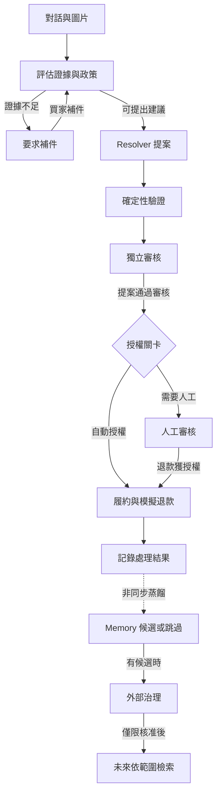

# Return Atlas — Adaptive Return Resolution Agent

[English](README.md) · [繁體中文](README.zh-TW.md)

Return Atlas 協助買家與審核人員處理電商退貨申請，將最初的客訴轉為有政策依據的決策。這是 Team 27 的 Sea OpenAI Hackathon 專案：結合對話式 AI、證據檢查、獨立審核與明確授權，讓退款不會只由模型的一段回答決定。

[觀看 Demo](#demo) · [探索系統架構](https://michael3abc.github.io/2026ShopeeHackathonteam27/) · [閱讀詳細規格](docs/spec/README.md)

## 問題：一張照片，不等於完整案情

買家提供一張喇叭外殼裂痕的照片。照片顯示商品損壞，但能否證明「到貨時就已損壞」？有用的 Agent 必須辨識缺少的證據、要求補件，並在取得資料後接續處理，而不是立即核准或拒絕。

Return Atlas 把這件事視為工作流程，而非單次聊天回覆。系統將對話與圖片連結到訂單事實及適用政策，產生處置提案，再由獨立階段負責審核與執行。需要額外授權的案件交給人工；沒有依據的判斷不能直接變成付款指令。

## Demo

https://github.com/user-attachments/assets/f67e6288-6c3c-4cc5-9cf1-ed86b1656320

觀看時可注意三個轉折：

1. **要求補件：** Agent 先指出欠缺的證據，再繼續處理。
2. **恢復評估：** 新增圖片進入原案，不必從頭重建流程。
3. **先審核、再執行：** 介面分別呈現提案、驗證、審核與執行階段。

影片約 98 秒、1080p、中文介面、無音軌，展示單一案例，並非所有支援路徑。

> 案例與圖片為合成 Demo 素材；退款為模擬執行，不是真實付款。

[下載 MP4](https://github.com/michael3abc/2026ShopeeHackathonteam27/raw/refs/heads/main/docs/assets/return-atlas-demo.mp4) · [Demo 腳本與素材來源](docs/demo-user-dialogue.md)

## 三個核心工程設計

### 1. 推理不等於授權

看似合理的模型回答，不代表可以退款。Resolver 先提出處置建議，確定性 Verification 檢查提案，獨立 LLM Reviewer 再依政策與證據審核；金額與使用者風險關卡接著決定是否需要人工授權。契約不合法或依賴服務不可用時，系統明確停止自動化或轉交處理。

這讓決策過程可以查證，也避免同一段模型輸出同時掌握判斷與執行權。

### 2. 保存進度，避免重複執行

補件、人工審核與服務中斷可能跨越多次互動。LangGraph checkpoint 保存執行進度；PostgreSQL journal 與 transactional outbox 透過 Redis Streams 串接服務。穩定的操作識別與退款 reservation 用來防止事件重送造成重複副作用，並支援執行結果未知時的復原。

因此系統能恢復有明確業務狀態的工作流程，而不必只靠聊天紀錄重建發生過的事。

### 3. 讓經驗重用受到治理

結案軌跡可產生有適用範圍的 Operational Memory 候選；沒有值得保留的經驗時也可以跳過。候選必須經外部治理核准，才能被後續案件檢索。檢索受政策版本與案件情境限制；經驗不能覆蓋資格或授權規則，獨立 Reviewer 也不讀取 Memory。

這裡的「自適應」是受治理的經驗重用，不是線上訓練，也不是已證明的自主改善。

## 工作流程如何串接

這是簡化的退款路徑，不是完整執行圖。人工核准仍須符合合法範圍與適用的退回／驗收條件；API 會在付款前再次檢查授權。拒絕、有限次修訂與失敗路徑見[工作流程規格](docs/spec/01-agent-graph.md)。Memory 處理與案件完成分開執行。

**技術棧：** Python · LangGraph · FastAPI · PostgreSQL/pgvector · Redis Streams · Next.js/TypeScript · 受 schema 約束的多模態模型呼叫。

[Architecture Explorer](https://michael3abc.github.io/2026ShopeeHackathonteam27/) 提供服務邊界與原始碼對照；其中案例明確標為示意流程，並非真實執行錄影。

## 已驗證到什麼程度

| 證據 | 能支持的結論 | 查證入口 |
| --- | --- | --- |
| UI 操作錄影 | 提交證據、接續處理，以及可見的審核／執行階段；UI 完成狀態本身不能證明 ledger 結果。 | [Demo](#demo)、[錄影說明](docs/demo-user-dialogue.md) |
| 有記錄的真實模型 E2E | 隔離的合成案例達到模擬退款 SUCCEEDED / APPLIED；Memory 重送保留首次結果。此證據與 UI 錄影分開。 | [附日期的執行紀錄](docs/progress.md#真實模型單案-e2e) |
| 自動化檢查 | CI 檢查契約、工作流程、復原行為、前端建置與架構一致性。 | [最新執行結果](https://github.com/michael3abc/2026ShopeeHackathonteam27/actions/workflows/checks.yml)、[測試定義](.github/workflows/checks.yml) |

**限制：** 本專案是使用合成資料與 Demo providers 的原型，不是正式 Shopee API 或金流整合。歷史 E2E 耗時不是模型延遲 benchmark。Memory 機制已實作，但尚未證明能改善準確率、處理時間或成本。驗證只適用記錄中的版本與設定，不代表所有組合都已通過。

## 直接探索或在本機執行

- **不需安裝：** 觀看錄影或開啟 Architecture Explorer，皆不需憑證。
- **不呼叫真實模型的測試：** 依[開發手冊](scripts/README.md#offline-checks)安裝 Python／Node 依賴並執行 deterministic suites。這些測試不等於啟動可操作的客戶端 Demo。
- **完整整合 Demo：** 依[本機設定手冊](scripts/README.md#integrated-demo-setup)準備 Docker 資料服務、授權模型／embedding endpoints、私密憑證及 buyer／reviewer／operator 身分。舊 v1 E2E runner 不具備 v2 stack 的登入流程。

深入閱讀：[政策與審核](docs/spec/03-reasoning-and-decision.md)、[受治理的 Memory](docs/spec/04-operational-memory.md)、[服務與狀態所有權](docs/spec/08-external-interfaces.md#system-ownership)、[模型與圖片整合](apps/agent_service/README.md)。深層工程文件目前以中文為主。

## 授權

本 repository 尚未提供開源授權。公開可見不代表已授權重製、散布或商業使用。
