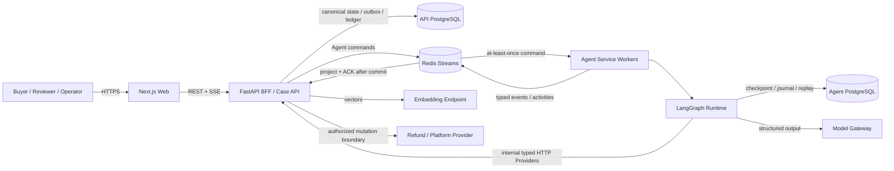

# External Interfaces

## Policy v2／User Risk 增補

- PolicyProvider 可收 `selected_path_id`，只適用固定版本的 v2 context；原 reason 不因途徑切換改寫，回傳完整四路徑包。
- Memory query 增 `policy_path_id`；v2 必須 exact Policy／registry／path，相容 P01 空 claims。v1 呼叫保留原欄位與 major 比對。
- `POST /internal/v1/user-risk/snapshot` 使用 service token、case_ref／reason_code／as_of；as_of 必等於 v2 case_opened_at，排除 current case，重送讀取同一 immutable snapshot。
- 買家 `POST /cases/{case_ref}/policy-confirmations`、`return-confirmations`；operator `POST /demo/cases/{case_ref}/return-simulation`；可信 producer `POST /internal/v2/return-events`。各自驗 role／owner 或 service token，版本與要求 hash 不符回 409。
- `POST /auth/login` 使用後端配置之個人憑證，發不透明 HttpOnly cookie；瀏覽器不能提交可信 role。狀態變更要求配置的同源 Origin。
- Human dossier 的 snapshot 必須逐 facts 與持久化原件相符；相同 reference 不足以授權。
- API APPLIED transaction 同時寫入成功 ledger、REFUND_SUCCEEDED 與 `refund_completion_outbox`，發至 `return-agent.refund-completions.v2`。Agent DB 的 correction／APPLIED join 使用原 resolution_ref、authorization_ref、resolution_hash；任意到達順序及重送只建立一個 logical job。

上述為跨組邊界；履約等待不重跑 Reviewer。詳細限制與驗收見 [Policy v2](09-policy-v2-integration.md)、[User Risk](../USER_RISK_SPEC.md)。

本文件是 Agent 團隊遞交給其他團隊的**介面需求**。它定義 Agent 需要什麼，不規範對方如何實作。

Ownership 與 interface 是兩件事：退貨期限幾天由 Policy owner 決定（ownership），但條款必須以什麼欄位交付給 Agent 由 Agent 團隊決定（interface）。本文件只涵蓋後者。

Payload 的唯一可執行 canonical source 是 [`apps/contracts`](../../apps/contracts/README.md)：Python package 為 [`return_agent_contracts`](../../apps/contracts/src/return_agent_contracts/__init__.py)，Provider Protocol 見 [`interfaces.py`](../../apps/contracts/src/return_agent_contracts/interfaces.py)，JSON adapter DTO 見 [`transport.py`](../../apps/contracts/src/return_agent_contracts/transport.py)，跨物件規則見 [`validation.py`](../../apps/contracts/src/return_agent_contracts/validation.py)，非 Python 實作者可使用 [Agent v1 JSON Schema](../../apps/contracts/schemas/agent/v1/)。JSON Schema 驗證單一 wire payload 的 shape、union 與 scalar；Policy/Order/Handoff 等跨 DTO 關聯仍必須由 adapter 呼叫 `validation.py` 做 semantic validation。[Agent Contracts](02-agent-contracts.md) 保留語意與可讀範例。本文件定義**簽章、呼叫時機、JSON adapter envelope、失敗語意與 fixture 需求**；範例中的 nested payload 必須與 executable schema 一致，不建立第二套 schema。

## 三個最關鍵的需求

其他團隊不會自行想到這兩項，但缺少任一項系統都無法運作：

1. **`retrieve_policy` 必須回傳結構化條款，不是 top-k text chunks。**
   每個條款必須攜帶 `required_claim_ids[]`（引用 [Claim Registry](07-claim-registry.md)）、`return_policy`、`effective_from/to` 與 bundle 層的 `retrieval_status`。
   若只回傳自然語言 chunk，Agent 必須自行推斷「這個決定需要哪些待證事實」，claim 命名會不穩定，整個 evidence 判定與獨立複核機制失效。

2. **`load_case_context` 必須回傳 per-line-item 的 `refundable_amount` 與訂單層的 `refundable_amount_max`，且 `CaseContext.order_ref` 必須等於 `OrderSnapshot.order_ref`。**
   退款金額完全由此推導。Agent 不做折扣分攤、稅務計算或運費判斷。
   若只回傳商品原價，Agent 就沒有合法的金額來源。

3. **每個 line item 必須回傳 `category_ref`。**
   `OperationalMemoryStore.query_approved.categories` 只能從本案 `claimed_line_item_ids` 對應品項的分類推導。若訂單資料不提供分類，category-scoped memory 無法正確匹配。

## Inbound boundaries

Agent 呼叫或消費的 7 個邊界。前 5 個對應 [Agent Graph](01-agent-graph.md) 中 owner 為 `External` 的節點；`OperationalMemoryStore` 是 Agent 節點 `retrieve_memory` 所依賴的外部儲存與 approval workflow；`EvidenceProvider` 不是 LLM/routing 節點，由 prepare_memory_query 摘要前的 evidence ingestion，以及 `request_evidence` resume 後的 deterministic 邏輯呼叫，是 evidence artifact 的解析來源。

Agent 不直接依賴 raw database table、SQL 或對方的 HTTP path；Order DB、Memory DB 等實作都必須由 provider adapter 隔離。

```python
from typing import Protocol, Sequence

from return_agent_contracts.base import NonEmptyText, OpaqueRef, PositiveInt
from return_agent_contracts.enums import ClaimId, ReasonCode

class CaseContextProvider(Protocol):
    """graph node: load_case_context"""
    def load_case_context(
        self, case_ref: OpaqueRef
    ) -> CaseContextLoadResult: ...

class PolicyProvider(Protocol):
    """graph node: retrieve_policy"""
    def retrieve_policy(
        self,
        case_context: CaseContext,
        order_snapshot: OrderSnapshot,
        reason_code: ReasonCode,
        claimed_line_item_ids: Sequence[OpaqueRef],
    ) -> PolicyBundle: ...

class VerificationProvider(Protocol):
    """graph node: external_verification"""
    def verify(self, handoff: ProposedDecisionHandoff) -> VerificationResult: ...

class HumanReviewProvider(Protocol):
    """graph node: await_human_review (interrupt boundary)"""
    def submit_for_review(
        self, handoff: ProposedDecisionHandoff, review: RevisedReviewResult,
        dossier: HumanReviewDossier | None = None,
    ) -> OpaqueRef: ...
    def fetch_result(self, review_ref: OpaqueRef) -> HumanReviewResult | None: ...

class OperationalMemoryStore(Protocol):
    """非 graph 節點：Agent 節點 retrieve_memory 查詢的外部儲存；approval workflow 由外部擁有"""
    def query_approved(
        self,
        query_summary: NonEmptyText,
        market: NonEmptyText,
        reason_code: ReasonCode,
        required_claim_ids: Sequence[ClaimId],
        categories: Sequence[OpaqueRef],
        policy_versions: Sequence[OpaqueRef],
        claim_registry_major: PositiveInt,
        top_k: PositiveInt = 3,
    ) -> Sequence[MemorySearchHit]: ...
    def submit_candidate(self, candidate: MemoryCandidate) -> OpaqueRef: ...

class EvidenceProvider(Protocol):
    """由 assessment 前與 request_evidence resume 後的 deterministic 邏輯呼叫；evidence artifact 儲存與中性摘要產生"""
    def resolve(self, artifact_ref: OpaqueRef) -> EvidenceItem: ...
```

簽章中的 DTO、enum 與 scalar type 以 [`return_agent_contracts`](../../apps/contracts/src/return_agent_contracts/__init__.py) 為準；[Agent Contracts](02-agent-contracts.md) 與 [Operational Memory](04-operational-memory.md) 說明其語意。本文件不重複 schema。

所有 read/evaluate 方法對相同的 versioned input 必須可安全重試。`submit_for_review` 以 `handoff.handoff_id`、`submit_candidate` 以 `candidate.memory_id` 作為冪等鍵；相同鍵重送必須回傳原本的 reference，不得建立重複工作。

### 呼叫總表

| Provider method | 白話用途 | 建議實作對口 | 呼叫者／時機 | 執行型態 | 參數 | 回傳 |
| --- | --- | --- | --- | --- | --- | --- |
| `load_case_context` | 提供可信的案件、訂單與物流 snapshot；不判斷退款資格。 | 訂單／物流／Backend | `load_case_context` node | 同步 read | `case_ref` | `CaseContextLoadResult` |
| `retrieve_policy` | 依案件找出適用的結構化規則與 required claims；不只回傳文字 chunks。 | Policy RAG | `retrieve_policy` node | 同步 read | case/order snapshot、reason、claimed items | `PolicyBundle` |
| `query_approved` | 取回 scope 相符且已核准的操作建議；不得讓 memory 蓋過正式 Policy。 | Operational Memory／治理 | `retrieve_memory` node | 同步 read | `query_summary`、scope、policy/registry versions、`top_k ≤ 3` | `MemorySearchHit[]` |
| `resolve` | 將使用者上傳檔案 reference 解析為中性 evidence 摘要；不替 Agent 判定 claim。 | Evidence／檔案服務 | context／claimed items 確定後的首次 assessment 前，以及 `request_evidence` resume 後 | 同步 read/resolve | `artifact_ref` | `EvidenceItem` |
| `verify` | 驗證 handoff 格式、引用與硬規則；不修改 Agent 的 decision。 | Verification | `external_verification` node | 同步 evaluate | 完整 handoff | `VerificationResult` |
| `submit_for_review` | 建立或取回人工審核工作；同一 handoff 不得重複建案。 | Human Review／案件流程 | `await_human_review` 首次進入 | 非同步 submit | handoff、最後的 RevisedReviewResult | `review_ref` |
| `fetch_result` | 查詢人工審核結果；未完成時回 `None`，不管理 LangGraph state。 | Human Review／案件流程 | `await_human_review` resume/poll | 同步 read | `review_ref` | `HumanReviewResult`，或未完成的 `None` |
| `submit_candidate` | 儲存待核准的 memory candidate；核准流程在外部，不能改寫正式 Policy。 | Operational Memory／治理 | async Memory worker | 非同步 submit | `MemoryCandidate` | `submission_ref` |

Memory query 的 `categories` 必須依下式由 graph deterministic 產生，不得讓模型填寫，也不得混入未被申請退貨的其他品項：

```text
categories = sorted(unique(
    item.category_ref
    for item in order_snapshot.line_items
    if item.line_item_id in claimed_line_item_ids
))
```

Memory store 只回傳 `status = APPROVED`，category matching 為：`scope.categories` 為空，或與呼叫參數 `categories` 至少有一個交集。

### JSON adapter 格式

JSON 範例使用統一邏輯 envelope：呼叫為 `{"method", "params"}`，成功回傳為 `{"result"}`。這是 Agent adapter 的交換語意，不規定 HTTP path、status code 或 RPC framework。

#### CaseContextProvider.load_case_context

```json
{
  "method": "CaseContextProvider.load_case_context",
  "params": { "case_ref": "CASE-001" }
}
```

```json
{
  "result": {
    "case_context": {
      "case_ref": "CASE-001",
      "order_ref": "ORDER-001",
      "market": "TW",
      "case_opened_at": "2026-09-01T10:00:00Z",
      "snapshot_version": 3
    },
    "order_snapshot": {
      "order_snapshot_ref": "ORDER-001@12",
      "order_ref": "ORDER-001",
      "snapshot_version": 12,
      "captured_at": "2026-09-01T10:00:00Z",
      "currency": "TWD",
      "delivered_at": "2026-08-25T09:00:00Z",
      "line_items": [
        {
          "line_item_id": "LI-002",
          "sku_ref": "SKU-B",
          "category_ref": "CAT-AUDIO-SPEAKERS",
          "title": "藍牙喇叭",
          "quantity": 1,
          "refundable_amount": "1200"
        }
      ],
      "refundable_amount_max": "1200",
      "already_refunded_amount": "0"
    }
  }
}
```

#### PolicyProvider.retrieve_policy

```json
{
  "method": "PolicyProvider.retrieve_policy",
  "params": {
    "case_context": {
      "case_ref": "CASE-001",
      "order_ref": "ORDER-001",
      "market": "TW",
      "case_opened_at": "2026-09-01T10:00:00Z",
      "snapshot_version": 3
    },
    "order_snapshot": {
      "order_snapshot_ref": "ORDER-001@12",
      "order_ref": "ORDER-001",
      "snapshot_version": 12,
      "captured_at": "2026-09-01T10:00:00Z",
      "currency": "TWD",
      "delivered_at": "2026-08-25T09:00:00Z",
      "line_items": [
        {
          "line_item_id": "LI-002",
          "sku_ref": "SKU-B",
          "category_ref": "CAT-AUDIO-SPEAKERS",
          "title": "藍牙喇叭",
          "quantity": 1,
          "refundable_amount": "1200"
        }
      ],
      "refundable_amount_max": "1200",
      "already_refunded_amount": "0"
    },
    "reason_code": "ITEM_DAMAGED",
    "claimed_line_item_ids": ["LI-002"]
  }
}
```

```json
{
  "result": {
    "policy_bundle_version": "bundle:2026-09-01T10:00:05Z",
    "retrieval_status": "OK",
    "retrieved_at": "2026-09-01T10:00:05Z",
    "clauses": [
      {
        "clause_id": "POLICY-12:v3#4.2",
        "policy_version": "POLICY-12:v3",
        "effective_from": "2026-01-01T00:00:00Z",
        "effective_to": null,
        "applicable_conditions": {
          "markets": ["TW"],
          "reason_codes": ["ITEM_DAMAGED"],
          "categories": ["CAT-AUDIO-SPEAKERS"]
        },
        "required_claim_ids": [
          "DELIVERY_CONFIRMED",
          "ORDER_WITHIN_RETURN_WINDOW",
          "ITEM_PHYSICALLY_DAMAGED",
          "DAMAGE_PRESENT_ON_ARRIVAL"
        ],
        "allowed_actions": ["FULL_REFUND", "DECLINE"],
        "return_policy": "MODEL_JUDGMENT",
        "text": "商品到貨即受損者，得於到貨後七日內申請退款。"
      }
    ]
  }
}
```

#### OperationalMemoryStore.query_approved

```json
{
  "method": "OperationalMemoryStore.query_approved",
  "params": {
    "market": "TW",
    "reason_code": "ITEM_DAMAGED",
    "required_claim_ids": [
      "ITEM_PHYSICALLY_DAMAGED",
      "DAMAGE_PRESENT_ON_ARRIVAL"
    ],
    "categories": [
      "CAT-AUDIO-SPEAKERS"
    ],
    "policy_versions": [
      "POLICY-12:v3"
    ],
    "claim_registry_major": 1,
    "top_k": 3,
    "query_summary": "音箱受損申請，目前照片只有商品近拍。"
  }
}
```

```json
{
  "result": [
    {
      "memory": {
        "memory_id": "MEM-001",
        "status": "APPROVED",
        "recommended_behavior": "Request all missing evidence in a single EvidenceRequest.",
        "trigger_conditions": [
          "damage claim evidence contains only a close-up of the product",
          "at least two required USER_EVIDENCE claims are missing at the same time"
        ],
        "policy_version": "POLICY-12:v3",
        "claim_registry_version": "claim-registry:1.0",
        "scope": {
          "market": "TW",
          "reason_codes": [
            "ITEM_DAMAGED"
          ],
          "claim_ids": [
            "DAMAGE_PRESENT_ON_ARRIVAL"
          ],
          "categories": [
            "CAT-AUDIO-SPEAKERS"
          ]
        },
        "confidence": 0.72,
        "approved_at": "2026-09-02T09:00:00Z",
        "retrieval_summary": "Damage claim has incomplete evidence; request missing evidence together."
      },
      "similarity": 0.82
    }
  ]
}
```

#### EvidenceProvider.resolve

```json
{
  "method": "EvidenceProvider.resolve",
  "params": { "artifact_ref": "artifact://evidence/EV-002" }
}
```

```json
{
  "result": {
    "evidence_id": "EV-002",
    "type": "IMAGE",
    "source": "USER",
    "subject": "LI-002",
    "artifact_ref": "artifact://evidence/EV-002",
    "extracted_summary": "外箱側面塌陷，商品裂痕與塌陷位置對應。",
    "collected_at": "2026-09-01T10:40:00Z"
  }
}
```

#### VerificationProvider.verify

```json
{
  "method": "VerificationProvider.verify",
  "params": {
    "handoff": {
      "handoff_version": "1.0",
      "handoff_id": "HANDOFF-001",
      "case_ref": "CASE-001",
      "order_snapshot_ref": "ORDER-001@12",
      "policy_bundle_version": "bundle:2026-09-01T10:00:05Z",
      "claim_registry_version": "claim-registry:1.0",
      "proposed_decision": {
        "action": "FULL_REFUND",
        "refund_scope": { "line_item_ids": ["LI-002"] },
        "amount": "1200",
        "currency": "TWD",
        "reason_code": "ITEM_DAMAGED",
        "return_decision": {
          "source": "MODEL_JUDGMENT",
          "requirement": {
            "required": false,
            "reason_code": "ITEM_UNSALVAGEABLE"
          }
        },
        "policy_refs": ["POLICY-12:v3#4.2"],
        "evidence_refs": ["EV-002"]
      },
      "evidence_bundle": [
        {
          "evidence_id": "EV-002",
          "type": "IMAGE",
          "source": "USER",
          "subject": "LI-002",
          "artifact_ref": "artifact://evidence/EV-002",
          "extracted_summary": "外箱側面塌陷，商品裂痕與塌陷位置對應。",
          "collected_at": "2026-09-01T10:40:00Z"
        }
      ],
      "policy_refs": ["POLICY-12:v3#4.2"],
      "rationale_summary": "LI-002 的 required claims 均有支持，因此提案全額退款該品項。",
      "revision_round": 0,
      "agent_prompt_version": "resolver:1.0"
    }
  }
}
```

```json
{
  "result": {
    "status": "PASS",
    "issues": [],
    "verification_version": "verification:1.0"
  }
}
```

#### HumanReviewProvider.submit_for_review

```json
{
  "method": "HumanReviewProvider.submit_for_review",
  "params": {
    "handoff": {
      "handoff_version": "1.0",
      "handoff_id": "HANDOFF-001",
      "case_ref": "CASE-001",
      "order_snapshot_ref": "ORDER-001@12",
      "policy_bundle_version": "bundle:2026-09-01T10:00:05Z",
      "claim_registry_version": "claim-registry:1.0",
      "proposed_decision": {
        "action": "FULL_REFUND",
        "refund_scope": {
          "line_item_ids": [
            "LI-002"
          ]
        },
        "amount": "1200",
        "currency": "TWD",
        "reason_code": "ITEM_DAMAGED",
        "return_decision": {
          "source": "MODEL_JUDGMENT",
          "requirement": {
            "required": false,
            "reason_code": "ITEM_UNSALVAGEABLE"
          }
        },
        "policy_refs": [
          "POLICY-12:v3#4.2"
        ],
        "evidence_refs": [
          "EV-002"
        ]
      },
      "evidence_bundle": [
        {
          "evidence_id": "EV-002",
          "type": "IMAGE",
          "source": "USER",
          "subject": "LI-002",
          "artifact_ref": "artifact://evidence/EV-002",
          "extracted_summary": "外箱側面塌陷，商品裂痕與塌陷位置對應。",
          "collected_at": "2026-09-01T10:40:00Z"
        }
      ],
      "policy_refs": [
        "POLICY-12:v3#4.2"
      ],
      "rationale_summary": "LI-002 的 required claims 均有支持，因此提案全額退款該品項。",
      "revision_round": 3,
      "agent_prompt_version": "resolver:1.0"
    },
    "review": {
      "verdict": "REVISE",
      "reviewer_claim_findings": [
        {
          "claim_id": "ITEM_PHYSICALLY_DAMAGED",
          "subject": "LI-002",
          "status": "SUPPORTED",
          "supporting_evidence_refs": [
            "EV-002"
          ],
          "explanation": "照片呈現商品裂痕。"
        }
      ],
      "revision_reasons": [
        {
          "code": "RETURN_REQUIREMENT_INCONSISTENT",
          "message": "外觀裂痕未證明商品無法修復。",
          "policy_refs": [
            "POLICY-12:v3#4.2"
          ],
          "evidence_refs": [
            "EV-002"
          ],
          "subject": "LI-002",
          "required_change": "以證據支持免退貨理由，或修正退貨要求。"
        }
      ],
      "reviewer_prompt_version": "reviewer:2.1",
      "reviewed_at": "2026-09-01T10:45:00Z"
    }
  }
}
```

```json
{
  "result": "HUMAN-REVIEW-001"
}
```

首次進入 interrupt 時呼叫一次 `submit_for_review`；resume 或 polling 只能呼叫 `fetch_result`，不得再次提交。重跑首次提交時，由 provider 依 `handoff_id` 回傳同一 `review_ref`。

新案件的 params 另帶 `dossier: HumanReviewDossier`（欄位見 02-agent-contracts），與 handoff／review 一起納入 payload hash。上方省略 dossier 的舊格式仍可讀取／保存，但沒有原申請 scope 與完整資料就不能完成新裁決。API 的 `human_reviews.dossier_payload` 保存完整結構化歷程；不得用 SSE 暫存取代 durable record。

Dossier 的版本一致性涵蓋每一輪，不只最後提案；新增明確 registry 版本欄位，舊缺欄位資料不得冒充完整 dossier。0012 支援 PostgreSQL offline downgrade SQL，產生的 SQL 在刪欄位前以 DO block 檢查資料；存在 dossier 時中止，不能以 offline 模式繞過稽核保護。

#### HumanReviewProvider.fetch_result

```json
{
  "method": "HumanReviewProvider.fetch_result",
  "params": { "review_ref": "HUMAN-REVIEW-001" }
}
```

```json
{
  "result": {
    "decision": "EDIT",
    "review_note": "現有證據不足以建立到貨時已受損。",
    "corrected_decision": {
      "action": "DECLINE",
      "refund_scope": { "line_item_ids": [] }
    },
    "correction_reason_code": "CLAIM_NOT_ESTABLISHED",
    "final_resolution_ref": "RESOLUTION-001",
    "reviewed_at": "2026-09-01T11:00:00Z"
  }
}
```

尚未完成時成功回傳 `{ "result": null }`；這不是 provider error，graph 維持 interrupt。

#### OperationalMemoryStore.submit_candidate

```json
{
  "method": "OperationalMemoryStore.submit_candidate",
  "params": {
    "candidate": {
      "memory_id": "MEM-001",
      "trigger_conditions": [
        "damage claim evidence contains only a close-up of the product",
        "at least two required USER_EVIDENCE claims are missing at the same time"
      ],
      "recommended_behavior": "Request all missing evidence in a single EvidenceRequest.",
      "rationale": "Human correction showed that the evidence request should have been batched.",
      "source_case_refs": [
        "CASE-005"
      ],
      "source_event_refs": [
        "REV-001",
        "REV-002"
      ],
      "policy_version": "POLICY-12:v3",
      "claim_registry_version": "claim-registry:1.0",
      "scope": {
        "market": "TW",
        "reason_codes": [
          "ITEM_DAMAGED"
        ],
        "claim_ids": [
          "DAMAGE_PRESENT_ON_ARRIVAL"
        ],
        "categories": [
          "CAT-AUDIO-SPEAKERS"
        ]
      },
      "confidence": 0.72,
      "status": "CANDIDATE",
      "retrieval_summary": "Damage claim has incomplete evidence; request missing evidence together."
    }
  }
}
```

```json
{
  "result": "MEMORY-SUBMISSION-001"
}
```

此呼叫由非同步 Memory worker 執行；失敗必須留下可觀測記錄，不得回滾或阻塞主案件 `ResolutionHandoff`。是否重試或送 dead-letter 由該 worker owner 決定，不屬 Agent contract。

### 各邊界的失敗語意

案件決策所依賴的邊界必須 fail closed；Operational Memory 邊界則必須 non-blocking。兩者的失敗都必須是可辨識的回傳值或例外，不得靜默偽裝成成功。

| 邊界 | 失敗表達 | Agent 行為 |
| --- | --- | --- |
| `load_case_context` | 例外、`None`，或 case/order reference 不一致 | `terminate_automation`（`CONTRACT_VIOLATION`） |
| `retrieve_policy` | `retrieval_status = AMBIGUOUS \| NOT_FOUND` | escalate（`POLICY_AMBIGUOUS` / `POLICY_NOT_FOUND`） |
| `external_verification` | `status = UNAVAILABLE` | escalate（`VERIFICATION_UNAVAILABLE`） |
| `await_human_review` | `fetch_result` 回 `None` | 維持 interrupt，不推進 |
| `OperationalMemoryStore.query_approved` | 例外或空結果 | 視為空陣列，**流程照常進行**（memory 失敗不得阻塞案件）；例外時 working state `memory_retrieval_status` 記 `UNAVAILABLE`（空結果仍為 `OK`） |
| `EvidenceProvider.resolve` | 例外、artifact reference 不一致、一般訊息附件的 `subject` 不屬於 `ORDER`／claimed items，或補件附件的 `subject` 與 pending evidence request 不一致 | escalate（`CONTRACT_VIOLATION`） |
| `OperationalMemoryStore.submit_candidate` | 例外 | async worker 記錄失敗；不影響主案件。重試/dead-letter policy 由 worker owner 定義 |

`retrieve_policy` 的 `retrieval_status` 必須由 Policy owner 判定。讓 Agent 判斷「回傳的條款是否互斥」等於用模型的判斷決定是否信任模型的判斷；條款衝突、缺少適用版本或有效期間不明時，一律回 `AMBIGUOUS`。

### `EvidenceProvider` 的邊界約定

`EvidenceItem.extracted_summary` 必須是**中性觀察描述**，只陳述影像/文件中可見的內容。

初始或澄清 `UserTurn.attached_artifact_refs` 不應要求使用者在補件階段重傳。Graph 會在 order context 與 claimed items 已確定後解析尚未處理的 refs；同一 artifact reference 必須可安全重試，重複 reference 不得建立重複 evidence。此路徑沒有 pending `EvidenceRequest`，因此 subject 只允許 `ORDER` 或本案 claimed item；補件路徑則維持更嚴格的 pending-request subject 驗證。

它**不得**包含 claim 判定，且 `EvidenceItem` 契約刻意不含 `claims_supported`。證據與 claim 的對應完全由 `assess_case` 負責。若由摘要產生者預先標註「這張圖支持 `DAMAGE_PRESENT_ON_ARRIVAL`」，等於在 assess 之前完成判定，Reviewer 的獨立複核會被錨定，且「evidence 存在不等於 claim 成立」的原則被繞過。

## Outbound handoffs

Agent 產出、由外部消費的三個輸出。它們不是 Agent 呼叫的介面，但外部必須有接收方，否則 graph 有死路。

| 輸出 | 產生節點 | 消費方責任 |
| --- | --- | --- |
| `ResolutionHandoff` | `emit_resolution_handoff` | 執行或拒絕退款、寫入 canonical case status。Agent 不執行退款。執行端核對 persisted Verification、Reviewer 結果與必要的人工決定。 |
| `ManualEscalationHandoff` | `terminate_automation` | API 記錄原因並標記 terminal `ESCALATED`；結束本次自動流程，不建立人工裁決面板或等待 resume。後續外部接手不屬於此 graph。 |
| `MemoryCandidate` | `distill_memory` | 經 `submit_candidate` 送往 Approval workflow，將 `CANDIDATE` 升為 `APPROVED` 或丟棄。Agent 不得自行升級。 |

節點識別改為 `terminate_automation`；`ManualEscalationHandoff`、`MANUAL_ESCALATION` outcome、`ESCALATED` 狀態與原因碼不變。此事件契約變更需同步切換 API／Agent Service／Web，先排空舊工作；既有 checkpoint 不應直接跨版本 resume。

Compose 將 repository 內版本化 `config/reviewer-gates.json` 以 read-only bind mount 提供給 API 與 Agent Service；兩個服務使用相同 container path。設定版本與 fingerprint 必須一致，門檻只存在 JSON，不由 Compose environment 攜帶。

<a id="system-ownership"></a>

## 整合系統責任與狀態所有權



### 服務責任

| Component | 擁有 | 不擁有 |
| --- | --- | --- |
| `apps/web` | Browser UI state、表單、案例／Activity 顯示、同源 API proxy | canonical case state、角色判定、Graph resume、退款授權 |
| `apps/api` | Case lifecycle、Demo session、RBAC、API DB、outbox、SSE projection、Policy／Evidence／Verification／Human Review／履約／退款能力 | LangGraph 執行、Agent checkpoint、模型推理 |
| `apps/agent_service` | Redis workers、composition、command journal、checkpoint adapter、Activity／Memory workers | Public browser API、API DB、canonical case state、退款 mutation |
| `packages/agent_runtime` | 18-node LangGraph、typed working state、routing、prompts、模型與 Provider contracts 的使用方式 | Queue、HTTP server、business DB、UI state |
| `apps/contracts` | 跨服務 DTO、enum、validation、JSON Schema、HTTP／Redis adapter contracts | 服務 orchestration 或持久化實作 |
| API PostgreSQL | 案件、事件、政策、證據、授權、履約、退款 ledger、Memory vector index | Graph checkpoint 與 Agent command journal |
| Agent PostgreSQL | LangGraph checkpoint、command journal、Memory replay／completion join | canonical business lifecycle 與付款 ledger |
| Redis | Commands、events、activities、Memory jobs 的 at-least-once transport | 任何 canonical business truth |

### 狀態所有權

以下狀態不可互相替代：

1. **Backend business state**：`CaseStatus` 由 API 擁有並投影給 Web。
2. **Agent execution state**：`AgentState` 只描述 LangGraph 目前工作資料。
3. **Checkpoint / journal state**：由 Agent PostgreSQL 支援 resume、去重與重播。
4. **Frontend UI state**：由 API response／SSE event 映射，不直接訂閱完整 `AgentState`。
5. **Background state**：Activity narration 與 Memory distillation 可在案件 terminal 後繼續。

### 跨服務路徑

```text
User action
  → Web handler
  → Case API transaction
  → PostgreSQL transactional outbox
  → Redis command
  → Agent Service worker
  → LangGraph + typed HTTP Providers
  → Redis lifecycle / terminal events
  → API transaction + projection
  → REST / SSE
  → Web state update
```

API 不同步呼叫 LangGraph。Command 與 event 均可能重送，因此 command journal、event hash、projection cursor、outbox 與 side-effect key 必須維持冪等。

### 主要角色

| Actor | 權限與責任 |
| --- | --- |
| Buyer | 建立自己的案件、補充說明／證據、確認 Policy path 與退回要求。 |
| Reviewer | 查看授權 dossier，執行 `APPROVE`、`EDIT` 或 `REJECT`；不同於 LLM `reviewer` node。 |
| Operator | 以受限 Demo 介面模擬可信物流與驗收事件；不能任意指定付款結果。 |
| Agent Service | 消費 command、執行 LangGraph、呼叫 typed Providers 並發布事件。 |
| API / BFF | 擁有 canonical case state、身份／角色、資料持久化、投影、履約與退款邊界。 |

### 整合能力與邊界

| 能力 | 目前狀態 | 說明 |
| --- | --- | --- |
| 對話 intake、澄清、補件與 resume | 已實作 | LangGraph interrupt/checkpoint；API 以 typed command 恢復。 |
| Policy v1 / v2 | 已實作 | v2 支援猶豫期、到貨損壞、寄錯商品、獨立品項未交付及 path confirmation。 |
| Evidence 與圖片附件 | 已實作 | JPEG／PNG／WebP；`ASSESS`、`PROPOSE_OR_REVISE`、`REVIEW` 可載入實際像素。 |
| Verification、Reviewer 與修訂迴圈 | 已實作 | Reviewer 只輸出 `APPROVE`／`REVISE`；修訂耗盡轉 Human Review。 |
| Monetary / User Risk gates | 已實作 | Reviewer `APPROVE` 後由 deterministic code 決定自動化授權，不改寫 Reviewer verdict。 |
| Human Review | Demo 已實作 | 有角色投影、dossier integrity 與持久化結果；正式企業身份與 approval workflow 待接入。 |
| Return fulfillment | Demo 已實作 | 支援退回確認、到貨、驗收、爭議與逾期，付款僅在完整條件通過後釋放。 |
| Refund application | Deterministic Demo | 有 reservation、ledger、冪等與 UNKNOWN recovery；不是 Shopee 正式金流。 |
| Operational Memory | 已實作 | 結案後非同步 distillation；candidate 必須經外部治理核准才可檢索。 |
| 真實 LLM / Embedding call | 可配置 | 支援 OpenAI-compatible Chat／Responses 與 embedding endpoint；需另備授權 endpoint 與 key。 |
| Shopee Open API read/write | 待整合 | 目前 Order／Evidence 含 versioned fixture Providers，不宣稱正式商家或訂單串接完成。 |
| Architecture Explorer | 已發布 | 靜態網站，內容與案例不需要 Backend；案例明確標示為 Illustrative。 |

本專案不宣稱 production-ready 金流、正式 Shopee Open API 整合、真實客戶資料驗證、模型 latency／token benchmark，或已量測的學習效果。

## API 與 Agent Service 邊界

LangGraph library 部署於獨立的 Agent Service，由 Redis Streams 非同步接收
start/resume command 並發布 lifecycle/terminal event。可執行 DTO 與 stream
常數位於 [`service.py`](../../apps/contracts/src/return_agent_contracts/service.py)，
非 Python consumer 使用 [Agent v1 JSON Schema](../../apps/contracts/schemas/agent/v1/)。

| Stream | Payload | 語意 |
| --- | --- | --- |
| `return-agent.commands.v1` | `AgentStartCommand \| AgentResumeCommand` | API/outbox producer 送出 start 或符合目前 interrupt 的 resume。 |
| `return-agent.events.v1` | `AgentServiceEvent` | Agent Service 發布 node observation、interrupt、resolution、escalation 或 run failure。 |
| `return-agent.commands.dlq.v1` | `AgentCommandDeadLetter` | 無法通過 JSON/Pydantic contract 的原始 command；成功寫入 DLQ 後才 ACK。 |
| `return-agent.memory-jobs.v2` | `MemoryDistillationJob` | Memory Enqueue Worker 在 durable `RESOLVED` event 後，讀取 graph checkpoint 中的全案 learning trace 並發布蒸餾工作。 |
| `return-agent.memory-events.v2` | `MemoryServiceEvent` | Memory Worker 發布 `COMPLETED`（candidate 已提交或明確 `SKIP`）或 `FAILED`；事件含實際 distiller prompt version。 |
| `return-agent.memory-jobs.dlq.v2` | `MemoryJobDeadLetter` | 無法通過 memory job contract 的原始 payload；成功寫入 DLQ 後才 ACK。 |
| `return-agent.refund-completions.v2` | `RefundAppliedEvent` | API 成功交易的 completion outbox 發布；Agent durable join 配對 resolution／authorization reference 與 resolution hash。 |

每筆 Redis entry 只有一個 `body` 欄位，內容是完整 JSON。`command_id` 是執行
冪等鍵；`event_id` 是投影去重鍵；`event_index` 表示同一 command 內的順序。
Redis delivery 為 at-least-once，因此 consumer 不得依賴「只收到一次」。

`return-agent.events.v1` 同時有 API projector 與 Memory Enqueue Worker 兩個獨立
consumer group；兩者都會看到完整事件，不會互相搶走訊息。Memory Enqueue Worker
只對 `AgentResolvedEvent` 查詢 checkpoint；沒有完整蒸餾 input 的 resolution
直接 ACK，不建立 job。`job_id = "memory-v2:" + handoff_id`，Memory Worker 以 durable
journal 去重；`submit_candidate` 再以 `memory_id` 冪等，因此重送不得建立重複候選。
v2 FULL_REFUND 的 correction 與 APPLIED 分別保存到 Agent `memory_completion_joins`，
兩者皆存在且 resolution／authorization binding 相符才發布 job。允許任意到達
順序與重送；API 核准、等待退回、未知付款結果均不能替代 APPLIED。
首次模型結果與完整 terminal event 另存於 Agent DB `memory_job_results`，分別在
candidate submit／Redis publish 前 commit。重播只沿用已保存的 output、prompt
version、submission reference 與事件，不再呼叫模型；store 的 immutable-content
conflict 規則保持不變。Agent Service 的 Alembic version table 為
`agent_service_alembic_version`，不使用 API migration history。
Agent migration `0002_memory_model_profile` 另存 credential-free 模型設定，
`0003_memory_completion` 保存 v2 completion join；pending
工作不能換 prompt／profile 重算，舊已完成結果不改写。API start／resume command
與 USER_TURN event 共用訊息 ID；`EvidenceResume.turn` 僅為 learning 對話用途，
不替代 EvidenceProvider。新舊 DTO 需協調升級；舊缺對話 input 可裁決但蒸餾 SKIP。
Startup 以 advisory transaction lock 序列化；offline PostgreSQL SQL 與 online migration 都阻止丟棄非空 completion join。
首次 journal claim 使用 conflict-safe insert 加 row lock，並行新 job 只有一位
owner，其餘留待正常 lease／ACK replay，不因 initial insert race 產生 unique violation。
兩個 Memory loops 對 retry-safe 暫時性傳輸例外以 capped exponential backoff
恢復，stop/cancellation 可中斷等待；永久授權／契約／程式錯誤不得無限重試。
這個 fan-out 發生在主 Agent command 完成之後，Memory pipeline 的錯誤不得轉成
customer case 的失敗或改寫 `ResolutionHandoff`。

Agent Service 不寫 canonical case DB。API 收到 event 後才負責 UI projection、
case status transition 與 SSE persistence。API 建立案件／接受 resume 時，正式環境
必須以 transactional outbox 同 transaction 保存 command；該 DB adapter 不屬於
Agent 團隊。本地若未注入 outbox adapter，API 必須回 `503`，不得退回 in-process
runtime 或非 durable direct publish。

Human Review 完成後由 API 保存人工結果並 enqueue `AgentResumeCommand`，其
payload 為 `HumanReviewPollResume`；Agent Service 再呼叫 `fetch_result`。Reviewer
的 `REVISE` 仍是 graph 內部 loop，不會產生 service resume command。

### Repository reference transport

v1 Policy CLI 與 integrated-demo 必須共用 `data/policy.json.example`；v2 另用
明確版本化的 `data/policy-v2.json.example`，不改寫 v1 Policy。整合版以
`RETURN_AGENT_DEMO_DATA_DIR` 指定其所在目錄。不得另存同 family/version 卻不同
immutable content 的啟動 fixture。文件匯入後啟動整合版應為冪等重播；舊版衝突
fixture 仍須明確拒絕，不得自動覆寫既有 Policy 或刪除 retrieval history。

Policy embeddings 的 model identity 必須與目前 provider 相符，不能只驗證維度。
Ingestion／整合啟動與 retrieval 在不一致時明確失敗；維護者可先停止 retrieval，
以目標 embedding 設定執行 `return-agent-ingest-policy --input <fixture> --reembed`，
重建所有適用 fixture 的向量後重啟。重建是單一 transaction，只更新 embedding
及 model tag，不放寬 policy family/version immutable-content conflict 檢查，亦不
修改歷史 `PolicyBundle`。模型權重／版本變更應使用新 model identity。

上述 Protocol 不綁 HTTP，但本 repository 提供一組可執行 reference adapter。
`apps/agent_service` 的 `Http*Provider` 以 `Authorization: Bearer <service-token>`
呼叫 `apps/api`；request/response body 仍使用本文件的 typed transport envelope：

| Provider | Reference route |
| --- | --- |
| Case context | `POST /internal/v1/case-context` |
| Policy | `POST /internal/v1/policy` |
| Memory query/candidate | `POST /internal/v1/memory/query`、`POST /internal/v1/memory/candidates` |
| Evidence | `POST /internal/v1/evidence/resolve` |
| Verification | `POST /internal/v1/verification` |
| Human Review | `POST /internal/v1/human-reviews`、`POST /internal/v1/human-reviews/result` |
| User Risk（僅 v2） | `POST /internal/v1/user-risk/snapshot` |

HTTP status、timeout 或 schema 錯誤由 adapter 轉成明確例外，再由 graph 依本文件的
fail-closed/non-blocking 規則處理。這些 routes 是 repository deployment choice，
不是 Provider Protocol 的永久 transport 限制。

## Demo/UI adapter boundary

v2 deterministic 測試已覆蓋 gates、人審、履約、APPLIED 與 recovery；真模型
A–F、三個 risk persona 與 correction → candidate → governance → 下一案 retrieval
須以各自 artifact 驗收，最新完成與未完成項目見 [進度](../progress.md)。
舊 v1 no-UI／UI runner 沒有 Demo role 登入步驟，不代表 v2 整合驗收。
Demo RefundApplication 是模擬金流，APPLIED 不代表真實外部付款。

Demo/UI 使用獨立的 projection DTO，不直接使用、複製或改寫 Agent graph state。可執行來源是 [`ui.py`](../../apps/contracts/src/return_agent_contracts/ui.py)，雙向轉換集中在 [`adapters.py`](../../apps/contracts/src/return_agent_contracts/adapters.py)；非 Python 實作者使用 [UI v1 JSON Schema](../../apps/contracts/schemas/ui/v1/)。Core 與 UI contract 都集中在 `apps/contracts`，但仍維持不同 DTO，避免 UI payload 成為 Agent state。

這一層只負責把 core DTO 轉成適合顯示的摘要，以及把經 Backend 記錄的人工操作轉回合法的 resume DTO。它不是 Policy、Reviewer、canonical case status 或 LangGraph routing 的 owner。

### 事件與狀態顯示

- SSE `AgentEvent` 是由 `type` discriminator 驗證的 union；token、tool call/result、memory hit、interrupt、state change、node enter/exit、done、error 各自綁定固定 payload。`node` 使用 [Agent Graph](01-agent-graph.md) 的實際 node 名稱；`seq` 必填且為正整數，`ts` 只能以 `Z`/`+00:00` 表示 UTC。
- `CaseStatus`、SSE transport、signed evidence URL、case API 與 memory `hit_count` 由 Backend/UI 擁有，只供顯示，不得直接修改 graph working state。
- Tool arguments、結果與 evidence/policy 摘要必須先脫敏；不得把 secret、artifact bytes、raw signed URL 或模型隱藏推理放入事件。
- Node 只呼叫注入的 Provider Protocol，不依賴 HTTP。reference deployment 由 Agent Service 的 adapter 執行 HTTP；Runtime 使用 LangGraph `tasks` stream 產生 typed `NodeExecutionObservation`，Backend 再配置每案 `seq`、UTC `ts` 並投影成 `AgentEvent`。
- Node lifecycle 是 best-effort telemetry：queue 滿或寫入失敗時記錄 log 後丟棄，不得中斷 graph。Interrupt、terminal result 與 `CaseStatus` transition 不屬於可丟棄 telemetry。
- `GET /cases/{case_ref}/events` 以 SSE 傳送既有 `case_events` 中的 `agent_event`；SSE `id = seq`，`Last-Event-ID` 只續傳更大的序號。`user_turn` 共用 sequence 但不進此 stream，因此序號可有間隔。
- SSE disconnect 不取消 graph；Backend 以 250 ms 預設間隔短輪詢、每 15 秒送 heartbeat，terminal case 送完剩餘事件後關閉。兩個間隔皆由 API settings 控制。

### Typed interrupt 與履約確認不得混用

| Graph 情境 | UI projection | UI 回傳／後續 | 邊界 |
| --- | --- | --- | --- |
| `request_clarification` | `ClarificationInterruptPayload` | 使用者回覆新的 `UserTurn`，以 `ClarificationResume` 恢復 graph | 這是意圖／訂單品項澄清，不是補件或 Human Review。Backend 顯示狀態為 `AWAITING_CLARIFICATION`。 |
| `request_evidence` | `EvidenceRequestView` | 使用者補交 opaque `artifact_ref`，resume 後由 `EvidenceProvider.resolve` 解析 | 這是使用者補件，不是 Human Review。 |
| v2 `confirm_policy_path` | `PolicyConfirmationRequest` | owner buyer 經 policy-confirmations 保存回答，再以 PolicyConfirmationResume 恢復 | AWAITING_POLICY_CONFIRMATION；綁定政策／registry／path／scope／selection version／requirement hash。 |
| Reviewer 回 REVISE 且 revision_round >= 3 | HumanReviewPayload | APPROVE / EDIT / REJECT 後 resume | routing_reason = REVISION_BUDGET_EXCEEDED，提案尚未獲 Reviewer 核准。 |
| Reviewer APPROVE 且 Python 金額 gate 命中 | HumanReviewPayload + dossier.review_gate | 人工裁決後直接 emit，不再回 Reviewer | 高額待授權，顯示已核准、金額、門檻、幣別、規則版本及原因，不虛構異議。 |
| v2 Reviewer APPROVE + FULL_REFUND 且 risk HIGH／UNKNOWN | HumanReviewPayload + dossier.user_risk_gate | reviewer 角色人工裁決後 emit，仍受退回履約限制 | 金額 gate 原因優先；dossier 保存兩個 gate，買家不可讀 risk facts。 |
| Reviewer 回 `REVISE` 且 revision_round < 3 | 不建立 UI interrupt | 經 `record_revision_event` 回 `propose_decision` | 這是 Agent 內部 revision loop。 |

`HumanReviewPayload` 包含可稽核摘要與 dossier：handoff、decision、graph-derived amount/currency、evidence/policy display references、完整已審提案與 review history、最後的 review_result、routing_reason 與 memory ids。它不含 Chain-of-Thought 或大型 artifact bytes；artifact 使用既有受控 reference。金額使用 decimal string，例如 `amount = "1200"`、`currency = TWD` 表示 TWD 1,200。

人工三種結果都必須填 `review_note`。`EDIT` 只可修正 `action`、`refund_scope` 與退貨決定；若修正後為 `FULL_REFUND`，`return_decision.source` 必須是 `HUMAN_REVIEW`，required boolean 與 reason enum 必須相容。UI 不得覆寫 amount、currency、Policy 或 evidence。`generalizable` 只是 Memory 蒸餾提示，不能直接核准或發布 memory。

目前 Web 透過同源 `/backend/*` proxy 呼叫 Case API，SSE 不啟用 gzip buffering。
同案件頁的專用人工裁決面板串接 `POST /cases/{case_ref}/review`；UI 明確顯示「決定退款」（EDIT）與「決定不退款」（REJECT，永遠表示 DECLINE，不是反轉原建議）。APPROVE 契約保留給採用原建議的呼叫端。
退款可選原申請內的合法品項，包含原提案為 DECLINE 的案件；v2 目前限定原先單一品項，API 重算 evaluation／金額。不可輸入金額，固定 return Policy 鎖定退回要求。送出必須帶目前 `handoff_id`、非空整體 `review_note` 與 reviewer_id；啟用 Demo 認證時 reviewer_id 必須等於登入身分。舊 DTO 可解碼缺 handoff_id，但 API completion 拒絕缺少／過期 handoff。
API 先驗證持久化 dossier 與目前 Policy／訂單、範圍／退貨要求／退款上限，再以同一 transaction 保存結果、轉 OBSERVING 並 enqueue resume。失敗保留待人工並回傳原因；不新增人工補件。執行層依 persisted human authorization 重新核對，不再要求人工退款必須源自原本的 FULL_REFUND。
`CaseDetail.human_review` 結案後仍從 durable dossier 重建；`human_review_result` 顯示理由、身份與時間。送出後重新讀取 Backend projection，不在前端猜測終態。
LLM `reviewer` 與 Human Review 在畫面上分別呈現，不能互相代替。

部署需協調 API／Agent Service／Web，排空舊工作並備份後套用 Alembic `0012_human_review_dossier`。舊紀錄／來源／結果保留，缺失歷程不虛構回填；既有未完成舊審核須先處理，再切換新裁決流程。本變更不自動部署現有服務。

瀏覽器 live 驗收入口為 [`run_ui_e2e.mjs`](../../scripts/run_ui_e2e.mjs)：
使用既有 demo 資料與真實 Qwen／Embedding，驗證開案、SSE、補件 resume、
最終 RESOLVED / REVIEWER_APPROVE 及重新整理後的 node/state replay。退款金流仍使用
demo application adapter；此結果不表示已串接正式支付服務。

### Compass 本地 Responses 接入

Agent Service 的 `integrated-compass` profile 復用 integrated composition，
以 host process 呼叫既有 `http://127.0.0.1:8790/v1/responses`，
驗證模型 alias 為 `compass-5.6-luna`。這是本地 proxy 後接真實 Compass，
不是假模型、官方 OpenAI 直連或新增服務；不更動 router listener／credential。
沿用 model base URL、name、key/key-file 設定。現有 router 自行注入上游 key，
client 的 SDK placeholder 不具上游認證效力，不得將真正 Compass key 提交至 repo。

Compass profile 使用 streaming Responses、JSON Schema 與本地 Pydantic 驗證，
必須收到 completed 終態；拒絕、未完成串流、無法解析或不合法內容皆失敗，
沒有切換模型或退回 fake 的 fallback。不傳 temperature、reasoning effort 或
Qwen chat-template 參數；保留既有 Qwen LLM profile。Policy／Memory embedding
與查詢 DTO 則採本分支的 Memory VDB contract，見下方檢索說明。

Compass profile 原始接入驗收限定為模型連通：Compass 與原 Qwen LLM 均能回傳通過
Pydantic 驗證的 structured output，原 embedding provider 能回傳有效的
1536 維向量。Live calls 不放入一般 pytest。不以完整 case／Memory 終態
作為本次驗收條件，也不改動 graph、Human Review、風險規則或 Memory 排程。

### Compass embedding 接入

跨機器入口為 `https://compass.yoyoserver.com/v1`，同時提供 Responses 與
embeddings。入口驗證獨立 gateway Bearer key，只允許 `compass-5.6-luna` 與
`text-embedding-3-large`，不公開其他 private router routes。真正 Compass key
只存在 server-side router；本專案 `.env` 與 `.secrets/compass_gateway_key`
均被 Git ignore，後者僅為 client key。Host 使用 `uv run --env-file .env` 明確
載入；Compose 使用 `*_API_KEY_HOST_FILE` 掛載到固定的 container secret paths。
僅設定 gateway 不會遷移 API DB 或既有向量；Memory VDB 切換另依 Memory runbook 執行。

Embedding 可獨立指定 `RETURN_AGENT_EMBEDDING_BASE_URL=http://127.0.0.1:8790/v1`、
`RETURN_AGENT_EMBEDDING_MODEL=text-embedding-3-large` 與本地 SDK placeholder key。
本地 router 的 `/v1/embeddings` 僅轉送至 Compass；沿用 1536 維 contract。
Policy 與 Memory 現預設使用 Compass large；僅改接入設定不會重建任何既有向量。
已有資料庫切換模型時仍需明確 `--reembed`，不允許混用相同維度但不同模型的向量。

Reviewer 回 REVISE 且 revision_round >= 3 時，graph 產生 REVISION_BUDGET_EXCEEDED 並進人工審核 UI；這不是第三種模型 verdict。

### Memory 顯示與檢索

`MemoryRecordView` 可顯示 `CANDIDATE` 或 `APPROVED`，其 trigger/boundary/action 由 `MemoryCandidate` 或 `ApprovedMemory` deterministic 投影。`CANDIDATE` 僅供觀察；只有 `APPROVED` 可成為 `MemoryRetrievalPayload.hits[].memory` 並被 `retrieve_memory` 使用。UI 顯示、點擊或 `generalizable = true` 都不得改變此治理狀態。

API 與 Agent Runtime 的 Python invocation boundary 以
[`return_agent_contracts.runtime`](../../apps/contracts/src/return_agent_contracts/runtime.py)
為 canonical source，包含 start/resume request、clarification／evidence／human review／policy confirmation interrupt 與 terminal result
union。Human Review interrupt 同時攜帶 UI projection 所需的 handoff、review_result、policy
與 memory references；Backend 不讀取 LangGraph private state。Runtime 不得向 API
回傳未定型 interrupt dictionary。

## 獨立 Activity API v1

Activity 不改變既有 `/cases/{case_ref}/events`、案件狀態或退款授權，Web 使用
typed activities 與 narration 顯示流程。啟用 Demo session 時，JSON 與 SSE
均受同一 owner／role 授權及 risk projection；內部完整 tracing 不直接暴露給買家。

- `GET /cases/{case_ref}/activities?after_seq=0&limit=100`：回傳 `{events, next_cursor, has_more}`，limit 1–500；按每案獨立 seq 遞增。沒有新資料時 cursor 不變。
- `GET /cases/{case_ref}/activities/stream?after_seq=0`：SSE `event: activity`、`id: <seq>`；非負整數 `Last-Event-ID` 優先於 query。不存在案件 404、非法 header 400、非法 query 422。
- stream 不因 terminal case 關閉；每15秒 heartbeat，250ms polling。客戶端自行取消；中斷連線不取消任何業務工作。
- 先以分頁載入歷史，再用最後的 cursor 連線；重新連線只接受 seq 更大的事件，依 event_id 去重。不要用 occurred_at 作分頁 cursor。
- seq 是 API **接收／提交順序**，不是因果執行順序。用 run_id、attempt_id、operation_id、parent_operation_id 還原操作，narration 以 source_event_id 掛回摘要。
- 模型生命週期以 operation_id 配對；payload.name=ACTIVITY_NARRATION 表示非同步解說呼叫。它與來源 node 共用 attempt_id，但使用獨立 operation_id，parent_operation_id 指向來源 node operation；不可只憑同一 attempt 的 model FAILED 判定 node 失敗。
- 預設離線 demo 不注入 narration model。每份摘要仍有 narration 結果：status=UNAVAILABLE、error_code=NARRATION_DISABLED_OFFLINE_DEMO、text=null；這是「此模式未啟用解說」，不代表模型／node 執行失敗，也不會產生 ACTIVITY_NARRATION 的 model STARTED／FAILED。結構化摘要仍可直接使用，UI 訂閱與顯示由前端負責。
- 真實模型 profiles 沿用配置模型；timeout／無效輸出／呼叫失敗使用 NARRATION_UNAVAILABLE，不回退模板。停用結果同樣經快取、持久化、ACK、去重與 replay；切換 profile 不會重新解說已快取的來源摘要。

Synthetic SSE 範例（完整 envelope；其餘有預設值的 payload 欄位省略）：

```text
id: 12
event: activity
data: {"schema_version":"1.0","event_id":"summary-1","case_ref":"CASE-DEMO","seq":12,"occurred_at":"2026-09-11T03:00:00Z","scope":"CASE","run_id":"command-1","job_id":null,"node":"reviewer","operation_id":"op-1","parent_operation_id":null,"attempt_id":"attempt-1","payload":{"type":"node_summary","facts":{"verdict":"REVISE","next_node":"record_revision_event"}}}

id: 18
event: activity
data: {"schema_version":"1.0","event_id":"narration:summary-1","case_ref":"CASE-DEMO","seq":18,"occurred_at":"2026-09-11T03:00:04Z","scope":"CASE","run_id":"command-1","job_id":null,"node":"reviewer","operation_id":"op-1","parent_operation_id":null,"attempt_id":"attempt-1","payload":{"type":"narration","source_event_id":"summary-1","status":"COMPLETED","text":"複核要求修訂提案。下一步預計記錄修訂事件。","error_code":null}}

: keep-alive

```

API 配發 seq，producer 不可自帶；event_id 相同且內容相同為冪等重送，內容不同拒收。
Redis `return-agent.activities.v1` 只放 `body: ActivityEmission`；API 同 transaction 寫
`case_activities` 與 `activity_narration_outbox` 才 ACK。Outbox 投遞
`return-agent.narrations.v1`，可重送；worker 以來源事件快取輸出，API 再核對來源、案件、run、attempt、operation，至多保存一份解說結果。
非法訊息只將 message ID／safe code 放入 `.rejected` stream，不複製原始 body；暫時性 DB／Redis 失敗保留 pending 並重試、記錄安全錯誤。

Activity 尚未進 Redis 前使用有界記憶體 queue；程序崩潰／queue 滿可能遺失觀察，會記錄 incomplete 錯誤，**本版不提供完整稽核保證**。
不因 trace 或 narration 失敗變更裁決，不宣稱 terminal case 代表背景工作全數完成。
保留 stream／narration cache 直到可靠性與資料保留政策另行訂定；不可先 trim 未確認／未投影事件。Migration 0013 新增獨立表，有紀錄時禁止 downgrade。

## Stub 與整合策略

Agent 團隊負責 Protocol、fixture 資料需求與 **in-process test fakes**（test-only，屬 [Agent Acceptance Criteria](06-agent-acceptance-criteria.md) 的驗收 harness，不是生產 Mock API 服務），使 graph 在整合日之前隨時可端到端執行。

- Test fake 回傳 [Agent Acceptance Criteria](06-agent-acceptance-criteria.md) 中定義的 fixture 資料。
- 外部團隊各自負責其邊界的真實實作與對本 Protocol 的 adapter；若對方提供 REST，adapter 負責轉換，graph 不變。
- Test fake 資料的正確性不代表外部規則的正確性。

## Fixture 資料需求

各邊界必須能回傳下列情境，才能覆蓋驗收條件。詳細案例內容見 [Agent Acceptance Criteria](06-agent-acceptance-criteria.md) 的 Fixture 目錄，本表只列出對邊界的要求。

| 邊界 | 必須支援的情境 |
| --- | --- |
| `load_case_context` | 單商品訂單、多商品訂單、每個品項含 `category_ref`、`already_refunded_amount > 0` 的訂單 |
| `retrieve_policy` | `OK` 且 `return_policy = MODEL_JUDGMENT`、`OK` 且 `return_policy = REQUIRED`、`AMBIGUOUS` |
| `external_verification` | `PASS`、`FAIL` 帶 issue、`UNAVAILABLE` |
| `await_human_review` | `APPROVE`、`EDIT` 帶 `corrected_decision`、`REJECT` |
| `OperationalMemoryStore` | 空結果、1 筆 scope 相符的 `APPROVED` memory、同一 `memory_id` 重複提交只產生一筆 submission |
| `EvidenceProvider` | 商品特寫（僅支持當下狀態）、含外箱的影像（可支持到貨時點）、顯示商品完好的影像 |

`EvidenceProvider` 的三種影像是 evidence 判定的核心對照組：第一種使 `DAMAGE_PRESENT_ON_ARRIVAL` 為 `UNSUPPORTED`，第二種使其 `SUPPORTED`，第三種使 `ITEM_PHYSICALLY_DAMAGED` 為 `CONTRADICTED`。


### Memory 向量介面補充

query_approved 必須傳 query_summary（1–2000 字元）。result 是 MemorySearchHit[]：每筆 {memory: ApprovedMemory, similarity: float}，最多3筆。
篩選在 cosine 排序前；query_summary 不改動市場／原因／品類／claim／Policy／registry 條件。API 不生成 LLM 摘要，只做 embedding／DB 查詢。
API 與 Memory 使用相同 embedding provider；部署目標統一 Compass text-embedding-3-large/1536。任何模型不符或缺失向量都不可視為正常零結果或 confidence-only 結果。
部署 endpoint 必須由 RETURN_AGENT_EMBEDDING_BASE_URL 明確指定，未設定即拒絕啟動，不使用私人 gateway 預設值；專用 embedding key/key file 必填，不借用 OPENAI_API_KEY。RETURN_AGENT_EMBEDDING_TIMEOUT_SECONDS 預設25秒，必須有限且大於零；SDK 自動 retry 固定為0。
Agent node EXIT 的 memory_retrieval 透過既有 NODE_OBSERVED envelope 傳到 Redis。API 同 transaction 投影 node_exit 與 memory_retrieval SSE，沿用 event ID/index replay 去重。
UI 消費 status/query_summary/hits/error_code，依 seq 只保留最新整批結果，cosine 不等於 candidate confidence。
切換與回填順序見 [Memory runbook](04-operational-memory.md#遷移與切換-runbook)，舊工作與暫停 checkpoint 先排空／協調，不做即時相容 fallback。

## Policy v2、可信 snapshot 與退回履約

API 建案依後端 Demo scenario 的 order prefix／owner 選用政策，將
`policy_schema_version` 與可信 `v2_context_payload` 固定保存。未知 v2 prefix 或
owner 不符拒絕，不讀買家提供的角色、版本、例外或配送調查作為可信 facts。
v1 DTO／evaluator 保持原語意，v2 使用 `DEMO-TW-RETURNS:v2.0` 與
`claim-registry:2.0`；checkpoint 不跨版重播、不自動降級。

Policy provider 回傳完整適用包，四條路徑獨立評估；COOLING_OFF 空 claims
仍須通過可信 predicates，UNDELIVERED_ITEM 只採逐品項未交付 investigation。
Assessment 與 Reviewer 分別以自己的 findings 計算 evaluation；Reviewer
不得取得 Assessment 結論、Memory 或 risk。Memory retrieval 在 cosine 排序前
以 exact Policy／registry／path 過濾，P01 使用 path scope；path 變更後清除舊
hits 再查。Human EDIT 的新 evaluation 由 API 重算並保留歷史。

UserRiskProvider 只供 v2 Reviewer APPROVE + FULL_REFUND 之後的 deterministic
gate 使用。snapshot cutoff 必須等於 `case_opened_at`，統計排除 current case；
首次 snapshot 與 content hash 保存後，後續 profile 變化或補入歷史事件不改寫
同 snapshot facts。API／Agent 共用 `config/user-risk.json` Decimal evaluator：
LOW／MEDIUM PASS，HIGH／UNKNOWN 人工授權；金額 gate 原因優先，dossier 保存兩個
gate。Reviewer verdict 不因 gate 改變；revision exhaustion 與 snapshot 取回失敗
可合法缺少 risk snapshot，後者必須明確 UNKNOWN，不可冒充低風險。

Human dossier 的 snapshot 必須與 API persisted snapshot 逐欄完全一致，且
case／owner／reason／cutoff binding、持久化 payload hash 均相符；相同 reference
不能取代 facts 驗證。提交 dossier、人工結果與付款授權都核對該原件。
自動付款以同一 persisted snapshot 與同 config 重算 PASS；人工可依合法 dossier
授權，仍須符合其 Policy 的付款釋放條件。

| POST route | 呼叫者與輸入約束 | 保存與結果 |
| --- | --- | --- |
| `/cases/{case_ref}/policy-confirmations` | owner buyer；request_ref、selection_version、accept、idempotency_key | 保存版本化 policy consent 與同 transaction typed resume outbox；過期或變更內容重送回409。 |
| `/cases/{case_ref}/return-confirmations` | owner buyer；authorization_ref、return_requirement_hash、accept、idempotency_key | 接受轉 AWAITING_RETURN；拒絕交專責；不能更換退款 scope／金額。 |
| `/internal/v2/return-events` | service token、allowlisted producer；event identity、authorization／品項 binding、內容 hash與事件順序 | immutable receipt；arrival 在前、inspection 引用已接受的 arrival；相同事件重送只回原 receipt。 |
| `/demo/cases/{case_ref}/return-simulation` | operator；ARRIVED／PASS／DISPUTE／OVERDUE intent 與 idempotency_key | API 產生可信 synthetic event，仍走上述 receipt／順序驗證。 |
| `/internal/v1/user-risk/snapshot` | service token；typed case_ref／reason_code／as_of | immutable snapshot，HTTP Provider 不暴露 DB／profile 寫入能力。 |

核准後 required return 順序是 `AWAITING_RETURN_CONFIRMATION → AWAITING_RETURN
→ AWAITING_RETURN_INSPECTION`；已有完全符合 return requirement hash 的政策同意
可省略再次詢問。合法驗收或合法免退才進 `EXECUTING`，付款成功才 `RESOLVED`。
NORMAL／WATCH 自動授權與 HIGH／UNKNOWN 人工授權均不能跳過退回條件。
付款前再驗 scope、最新可退額、reservation、consent、evaluation 與 gate config；
缺失／改變時停止自動付款並交專責，不重跑 Reviewer。付款結果未知維持 reservation，
以原 execution key 與既有 worker lease recovery 恢復，不另造退款 key。

API 在確認 `APPLIED` 的同一成功 transaction 保存 refund ledger、
`REFUND_SUCCEEDED` 與 completion outbox。`case_ref + event_type` 去重並驗 immutable
facts；等待退回、人工核准與付款結果未知都不寫成功事件。API migration 單鏈
`0013_activity_tracing → 0014_memory_learning_sources → 0015_user_risk_authorization →
0016_policy_v2_fulfillment → 0017_image_attachments`，User Risk 三張
新表與 legacy risk_evaluations 分離；歷史非空時 online／offline downgrade 均阻擋。

### Demo session 與角色投影

`RETURN_AGENT_DEMO_IDENTITIES_FILE` 指向受限後端配置，包含每個 user_ref 的
role、個別 credential_sha256 與 allowed_origins。`POST /auth/login` 僅接受
user_ref／credential，由後端決定角色；回傳 opaque `return_agent_session`
HttpOnly、SameSite=Strict cookie，HTTPS 時加 Secure。DB 只保存 token hash；
`GET /auth/config` 表示是否啟用，`GET /auth/session` 讀登入身分，
`POST /auth/logout` 撤銷 session。登入／登出與其他狀態變更皆核對允許的 Origin。

buyer 只能建立、讀取與操作自己的 case；reviewer 才能取得 risk dossier／
人工裁決，reviewer_id 必須等於 session user_ref；operator 才能模擬物流。
角色不能由 browser header 或 body 自行宣告。Provider／return-event ingress
保留內部 service token，瀏覽器 cookie 不能替代 producer 授權。

API 對 Case JSON、events SSE、activities JSON／SSE、node inspector 輸入與
narration 執行角色投影；buyer／operator 移除 risk snapshot／gate／facts、
risk routing reason 與 human notes。SSE id／cursor／replay／heartbeat 語意保持
不變，敏感內容不靠 Web 隱藏。權限與洩漏驗收須覆蓋匿名、cross-owner、角色冒充
及兩條 stream；Demo 認證仍不代表已接入 production 身分平台。

### User Risk snapshot envelope

```json
{"method":"UserRiskProvider.prepare_snapshot","params":{"case_ref":"CASE-PV2","reason_code":"ITEM_DAMAGED","as_of":"2026-09-12T00:00:00Z"}}
```

```json
{"result":{"snapshot_ref":"user-risk-snapshot:example","case_ref":"CASE-PV2","user_ref":"USER-NORMAL","reason_code":"ITEM_DAMAGED","as_of":"2026-09-12T00:00:00Z","created_at":"2026-09-12T00:00:01Z","account_age_days":720,"orders_90d":15,"same_reason_claims_90d":1,"refunded_orders_90d":1}}
```

## 圖片上傳介面

- `GET /attachments/options?order_ref=…`：取得可信訂單品項、ORDER 外包裝選項及上傳限制。
- `POST /attachments`：multipart file、order_ref、subject、可選 case_ref；201 回傳 AttachmentView。
- `GET /attachments/{attachment_id}/content`：固定使用者可存取的圖片 bytes；private/no-store。
- `GET /internal/cases/{case_ref}/images/{attachment_id}`：service token 授權，只讀已綁定且已送出的當案圖片。
- `GET /cases/{case_ref}/conversation`：持久化使用者訊息與附件，case seq 排序；不取代 Agent event／Activity SSE。

未知引用 404、越界綁定 403、案件狀態衝突 409、大小限制 413、格式不符 415、無法解碼／無效品項 422、Provider 或儲存不可用 503。初次附件於 create transaction 綁定，補件沿用 message transaction 與單次狀態轉移。保留原本 metadata-only fixture Provider，不把使用者描述當作已看圖結果。

## 申請理解展示

Activity 既有 JSON、分頁與 SSE 傳送可選 intent_display；run／attempt／operation 對應快照，重播去重。Narration 仍只取得安全 facts，不新增展示資料輸入。
